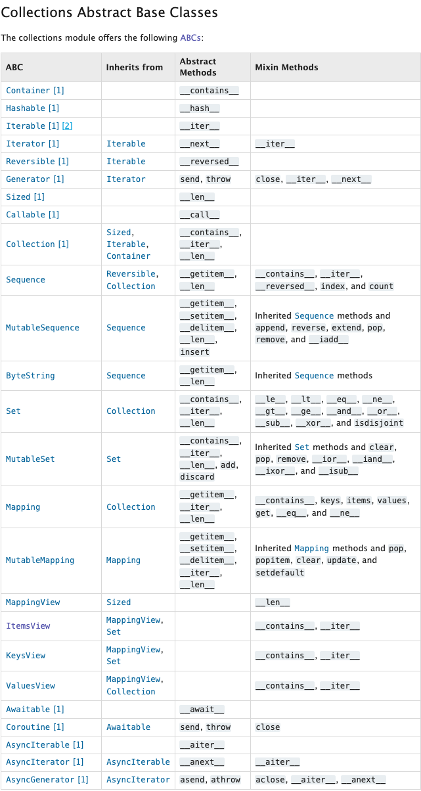

# Python

## ABC

[abc](https://docs.python.org/3/library/collections.abc.html#collections.abc.ItemsView)

To match the interface, implement the abstract methods.  Once mathing, Mixin methods are free because these are base classes.

## Type Hinting

Type hint on abcs when possible.
